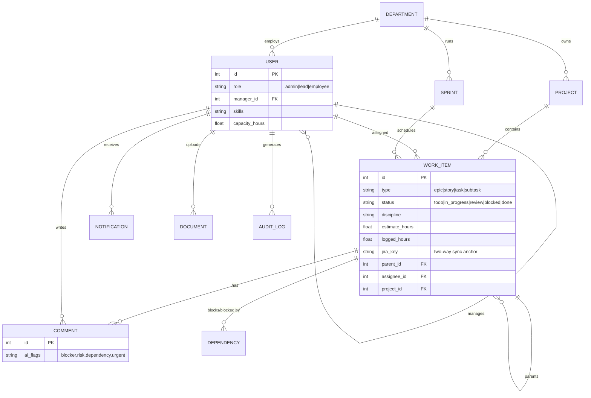

# ER Diagram

```mermaid
erDiagram
    DEPARTMENT ||--o{ USER : employs
    DEPARTMENT ||--o{ PROJECT : owns
    DEPARTMENT ||--o{ SPRINT : runs
    USER ||--o{ USER : manages
    PROJECT ||--o{ WORK_ITEM : contains
    WORK_ITEM ||--o{ WORK_ITEM : parents
    USER ||--o{ WORK_ITEM : assigned
    SPRINT ||--o{ WORK_ITEM : schedules
    WORK_ITEM ||--o{ COMMENT : has
    USER ||--o{ COMMENT : writes
    WORK_ITEM ||--o{ DEPENDENCY : "blocks/blocked by"
    USER ||--o{ NOTIFICATION : receives
    USER ||--o{ DOCUMENT : uploads
    USER ||--o{ AUDIT_LOG : generates

    WORK_ITEM {
        int id PK
        string type "epic|story|task|subtask"
        string status "todo|in_progress|review|blocked|done"
        string discipline
        float estimate_hours
        float logged_hours
        string jira_key "two-way sync anchor"
        int parent_id FK
        int assignee_id FK
        int project_id FK
    }
    USER {
        int id PK
        string role "admin|lead|employee"
        int manager_id FK
        string skills
        float capacity_hours
    }
    COMMENT {
        int id PK
        string ai_flags "blocker,risk,dependency,urgent"
    }
```
